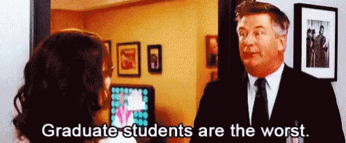
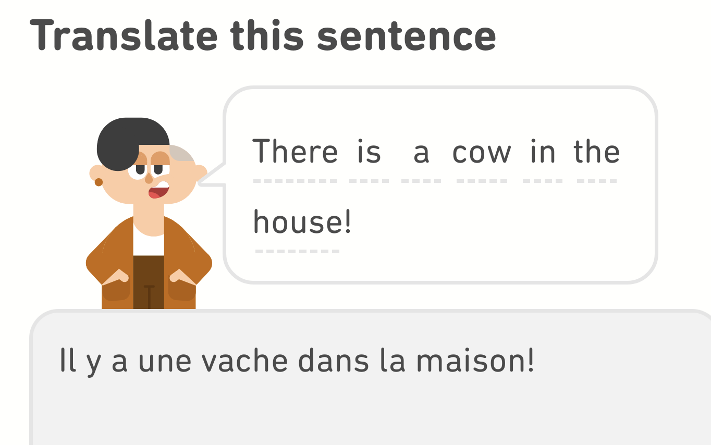
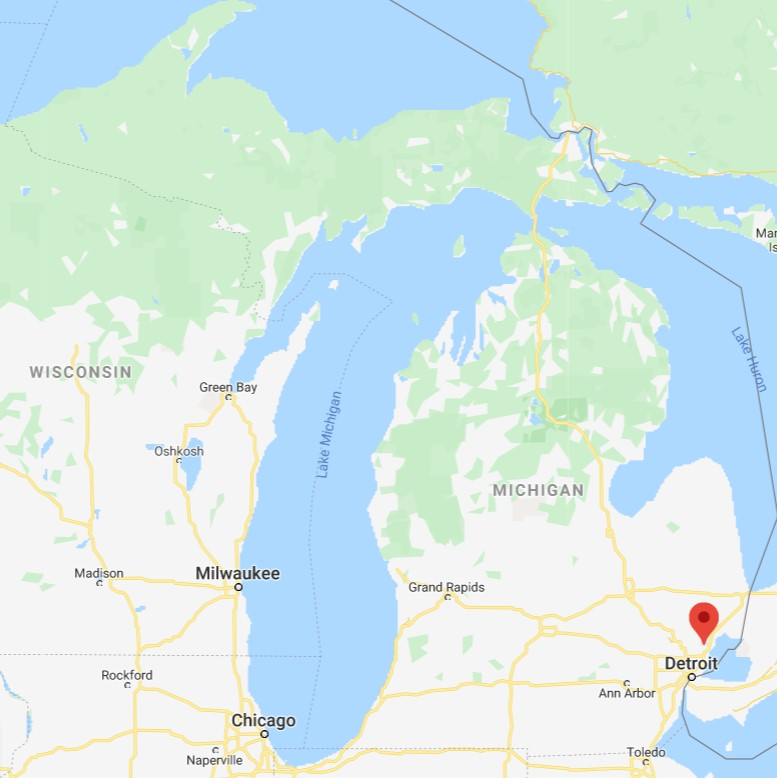

class: center

```{r setup, include=FALSE}
options(htmltools.dir.version = FALSE)
knitr::opts_chunk$set(echo = TRUE, include = TRUE, eval = TRUE, comment = NA)

## include iClicker slides?
iClickerQuestions <- FALSE
iClickerAnswers   <- FALSE
```

```{r xaringan-themer, include = FALSE, warning = FALSE}
library(xaringanthemer)
style_duo(primary_color = "#00274c",
          secondary_color = "#ffcb05",
          header_font_google = google_font("DM Serif Display"),
          text_font_google = google_font("Source Sans Pro", "400", "400i", "600"),
          code_font_google = google_font("Source Code", "400"),
          text_font_size = "22pt",
          code_font_size = "18pt"
)
xaringanExtra::use_tachyons()
xaringanExtra::use_fit_screen()
```


# Who am I? `r emo::ji("man_teacher")`

.pull-left[



<!--  -->


]

.pull-right[



]

---
# Who are you? `r emo::ji("woman_student")`

** While you are taking this class, you are a statistician! **

1. Change your Zoom name to include pronouns    
  - Right-click (or long press) your name in the Participants list, select "Rename"
  
1. Add a photo to your Zoom profile
  - Go to umich.zoom.us, sign in, and choose "Profile" on the left
  - This will be used across all your U-M Zoom meetings
  
---

# Course Policy

## Lab attendance
- It's expected that you attend these synchronous lab sessions and participate in the collaborative breakout sessions. 
  - Please do not leave when breakout rooms open! 
  
- If you can't make it to a synchronous session in a particular week, you *must* email me to get asynchronous materials. 

---

# Course Policy

## How to contact me
- Email me! The best address to do this is **[nseewald+250@umich.edu](mailto:nseewald+250@umich.edu)**
  - Make sure you put "STATS 250" in the subject line
  - If you don't put "STATS 250" in the subject OR email [nseewald+250@umich.edu](mailto:nseewald+250@umich.edu), *your email might get lost*.
  
- I will try to respond to all emails within 24 hours
  - Generally my email hours are 9a - 7p ET on weekdays
  
---
# Course Policy

.pull-left[
## Office Hours
- You can attend anybody's office hours you want!
  - Full schedule on Canvas
- Completely remote via Zoom (links on Canvas)
- I cannot confirm/deny whether your answers are "right"
]
.pull-right[
## My office hours:
<table style="font-size:20pt;">
  <tr style="text-align:center;">
    <td><strong>Day</strong></td>
    <td><strong>Time (ET)</strong></td>
  </tr>
  <tr style="color:var(--primary);">
    <td>Monday</td>
    <td>
      <a style="color:#000;" href="https://umich.zoom.us/j/97229098324?pwd=c1VWMjFUbFJ2VWFTWUpOVWlJQ0RSdz09">
        6:00p - 7:30p
      </a>
    </td>
  </tr>
  <tr>
    <td>Tuesday</td>
    <td>
      <a style="color:#fff;" href="https://umich.zoom.us/j/97229098324?pwd=c1VWMjFUbFJ2VWFTWUpOVWlJQ0RSdz09">
        6:00p - 7:30p
      </a>
    </td>
  </tr>
  <tr style="color:var(--primary);"> 
    <td>Thursday</td>
    <td>
      <a style="color:#000;" href="https://umich.zoom.us/j/97229098324?pwd=c1VWMjFUbFJ2VWFTWUpOVWlJQ0RSdz09">
        6:00p - 7:30p
      </a>
    </td>
  </tr>
</table>
]

---
# Lab Rules and Responsibilities

.pull-left[
## 1. Be Respectful.
- Come to synchronous sessions! Notify me of conflicts in advance.
- Treat your classmates with dignity and *learn from your differences*
- Respect yourself: *come here to learn*
]

--

.pull-right[
## 2. Actively Collaborate.
- Lab activities will involve working with your peers: you should participate and learn from each other.
- The time will pass faster if you're having conversations and working together!
]

---
# Health and Well-Being

College is hard (especially now). **Your health and well-being are more important than this class.**

If you're struggling with mental health, there are resources available to you at [wellbeing.studentlife.umich.edu](https://wellbeing.studentlife.umich.edu). 

CAPS: [caps.umich.edu](https://caps.umich.edu) or 734.764.8312

*If you become ill, please report the illness to LSA: https://webapps.lsa.umich.edu/SAA/UGStuAdv/App/Illness/RptIll.aspx*

**Let me know what's going on and I'll do my best to help.**

---

# Diversity, Equity, and Inclusion

It's important to me to cultivate a learning environment in which everyone's identities (race, ethnicity, gender, sexual orientation, religion, etc.) are respected. To this end:
- If you feel that your performance in the class is being affected by experiences inside **or** outside the classroom, please let me know.
- DEI is a process: I (and many others) am still learning about different perspectives and identities. If anything is said in class (by anyone, including by me) that made you feel uncomfortable, please let me know.

---

# Is this a math class?

Statistics is a *mathematical science*. This course will involve elements of a typical math course, but also less typical aspects.

- Often, you will be required to apply statistical knowledge *and* everyday knowledge ("common sense") to solve problems.
- In statistics, there is not always a "correct" answer. You should be prepared to argue (in words) for why your answer is reasonable.
- Written components of assignments are critical.
- Statistics requires **context**: you need to tell me what numbers mean and why we care. *No context = no points.*

.footnote[Adapted from [Martha K. Smith, University of Texas at Austin](https://web.ma.utexas.edu/users/mks/358Ksp06/M358K06syl.htm)]

---

# Lab Goals and Structure

- **Overall goal:** Give you hands-on experience working with data in **R**, a powerful statistical computing tool.
  - You'll complete weekly lab assignments using **R Markdown** via **RStudio Cloud**.

## Typical Lab Structure
- **Tutorial** (~30 minutes): We'll walk through how to perform tasks in R together
  - iClicker engagement questions sprinkled throughout (extra credit!)
- **Collaboration** (~40 minutes): You'll work on the lab assignment in breakout rooms
- **Wrap-Up** (~10 minutes): We'll talk about any questions or issues and complete a brief reflection.

---

# iClicker: STARTS NEXT WEEK

Please create an iClicker account!
  - Go to [iclicker.com](iclicker.com), sign in as a student
  - Sign up for an account at **University of Michigan Ann Arbor - LSA**
  - Use your @umich.edu email address
  - Your student ID is your **uniqname** (e.g., nseewald)
  
Join this course: 
  - Tuesday 1pm: **Stats 250 Lab Section 210**
  - Wednesday 8:30am: **Stats 250 Lab Section 214**

--

**Good iClicker participation earns you 1 extra credit point on the lab assignment.**

---
class: inverse, center, middle

# Let's get started!

---

# Learning Objectives

1. Learn the difference between R, RStudio, and R Markdown
1. Become familiar with the RStudio interface 
1. Understand key components of an R Markdown document
1. Learn how to use R to do basic calculations
1. Learn how to import data into R and name objects

---
# Getting Started: What is R?

- Statisticians (that means you!) often use computers to analyze data. 
- **R** is a popular (and powerful) program for manipulating data, doing calculations, and making graphs.
- R works by writing **`R code`**.

--

### Wait omg is this a coding class???

--
.pull-left[
<div style="text-align:center;"></div>
]

Over the course of the semester, you'll learn how to edit and write some basic R code to help you analyze data to answer research questions. **This will always be through the lens of answering statistical questions.**

---
class: center, middle, inverse

# Time for RStudio Cloud!

## http://bit.ly/250sbiwn21rsc

*Log in with Google using your U-M Account* (non-umich accounts will be deleted without warning)

---
# What are all these "R" terms?
There are a lot of "R" words floating around. What's going on?

- **R** is a "statistical computing environment" that's designed for manipulating data, generating plots, and performing analyses. It's also a programming language. You'll be *using R* this semester.
--

- **R Studio** is an "integrated development environment (IDE)" for R (you'll never have to hear the term IDE again in this class). Basically, it's a pretty interface that makes working with R easier. You use R inside of R Studio. If R is ice cream, R Studio is the cone or cup.
--

- **R Markdown** is a way to write pretty analysis reports that combines R code, R output (plots, analysis results, etc.) and text in one document. This lab document is an R Markdown report!

---
class: inverse
exclude: `r !iClickerQuestions`
# iClicker Question `r emo::ji('smartphone')`

.b.navy.ba.bw2.ph4.br4.f3[
Which of the following best describes your experience with R/RStudio?
]

A. What the heck are you talking about?

B. I've heard of it but never used it.

C. I used it previously in a class or project, but I'm no expert.

D. I could write R code in my sleep.

--
exclude: `r !iClickerAnswers`

.b.tc.m4.f3.bg-light-yellow.dark-red.br2[
Regardless of your experience with R, you should be able to do all of the lab assignments in this class!
]

---
# R Markdown

- Document creation interface
- Integrate text with R code, R output, and graphs
- Type code in **chunks**:

````md
`r ''````{r chunkName, <chunk options>}
# Type code here

```
````

--
### Common Error Alert!

- Make sure you have only **one** set of backticks at the beginning and end of a chunk
- Make sure each chunk has a **unique** name

---
# R Markdown Formatting

.pull-left[

<code style="color:#fff;">

\*\*This text will be bold\*\*

\*This text will be italic\*

\`This text will look like code\`

</code>

]

.pull-right[
**This text will be bold**

*This text will be italic*

`This text will look like code`
]

-- * 

Some tips:
- KNIT AND KNIT OFTEN
- If spacing looks weird, add a blank line


---
# Using R as a Calculator

At its most basic, R is a fancy calculator.

Here's a code chunk in which we do some math:
````md
`r ''````{r calculatorExample}
5 * 7
```
````

Output:

```{r calculatorExample, echo = FALSE}
5 * 7
```

---

# Try it! (Line ~87)

In your R Markdown document, edit the code chunk that looks like this (line ~87) to compute 50 divided by 9:
````md
`r ''````{r tryItCalculator, error = T}
# Write code here! This text is a comment, so it's not run by R. 
# Replace it withcode to compute 50 divided by 9.
```
````

--
Solution:

```{r tryItCalculator}
50 / 9
```

---
# R Functions

- We'll be using R primarily by using *functions*.
  - These work just like math functions: they take inputs and return outputs
  
```{r genericFunction, eval = F}
function.name(argument1, argument2, ...)
```

- Arguments to functions go **inside** parentheses and are separated by commas
- **Finish what you started:** make sure you close parentheses you open!
- Don't put a space between the name of the function and the open parenthesis

---
# R "Assignment" Syntax (line ~104)

- Often, we want R to remember the results of a calculation so we can use it later.
- We can **assign** these results a name:

```{r assignmentDemo}
x <- 36 / 6
```

- Read `<-` as "gets": "x *gets* 36 divided by 6"

---
# R "Assignment" Syntax (line ~ 111)

```{r assignmentDemo}
```

Now we can ask R what `x` is:

```{r x}
x
```

**NOTE:** R is "case-sensitive", which means that upper-case letters are *different than* lower-case letters. Notice what happens when we ask R for the value of `X`:

```{r X, error = T}
X
```

---
# "Valid" Names in R
- Names can contain only letters, numbers, periods (`.`) and underscores (`_`). 
- Must start with a letter or period.

--

.pull-left[
```{r badName1, error = T}
tik tok <- 12
```
```{r goodname1}
tiktok <- 12
```
`r emo::ji("check")`
]

--

.pull-right[
```{r badName2, error = T}
4eva <- 4 * 2
```
```{r goodname2}
forever <- 4 * 2
```
`r emo::ji("check")`
]

---
# CSV Files

- A common way to store data
- CSV = "**C**omma **S**eparated **V**alues"

```{r echo = F}
write.csv(head(read.csv("penguins.csv")), row.names = F)
```

- Each row is a *case* or *observation*
- Each column is a *variable*

---

class: inverse

# Palmer Penguins Data `r emo::ji("penguin")`
We're going to learn about some basic R functions using a data set on 333 penguins living on 3 islands in the Palmer Archipelago in Antarctica. 

.pull-left[
Data were made available by [Dr. Kristen Gorman](www.uaf.edu/cfos/people/faculty/detail/kristen-gorman.php)
and the [Palmer Station, Antarctica Long Term Ecological Research area](pal.lternet.edu), a member of the Long Term Ecological Research Network. The data were prepared by [Dr. Allison Horst](github.com/allisonhorst/palmerpenguins)
]

.pull-right[
]

---
# "Read in" data

```{r readData}
penguins <- read.csv("penguins.csv", stringsAsFactors = TRUE)
```

- The `read.csv` function takes a CSV file and imports it into R.
- What name did we give the data in R?
- Don't worry about `stringsAsFactors = FALSE` right now.

---
# Peek at the first 6 rows of the data
```{r headPenguins}
head(penguins)
```

- Read this code as "head of penguins"

---
# View the `str`ucture of the data

```{r strPenguins}
str(penguins)
```

- Read this code as "stir of penguins"

---
class: center, inverse, middle

# Now it's your turn!


---

# Lab Project `r emo::ji("keyboard")`

- You will be moved to a breakout room for the rest of the lab (minus ~10 minutes)
- Introduce yourself to your collaborators!
  - **The person whose birthday is next introduces themselves first**

.pull-left[
### Your task
- Open "lab01-report.Rmd" from the Files pane
- Answer each question in the provided answer blocks:
```md
:::{.answer}
:::
```
]

.pull-right[
### How to get help
- I'll be floating around between breakout rooms to check on everyone
- Use the "Ask for help" button to flag me down
- Let me know when you're done
]

---

# `r emo::ji("inbox_tray")` Lab Submission: Finding Your Report
Hit the Knit button one last time, then:
.pull-left[
## RStudio Cloud
1. In the Files pane, check the box next to `lab01-report.html`
2. Click More > Export...
3. Click Download and save the file on your computer in a folder you'll remember and be able to find later.
]
.pull-right[
## RStudio Desktop (local)
1. Locate the `lab01-report.html` file on your computer. The file will be saved in the location indicated at the top of the files pane. 
]

---

# `r emo::ji("inbox_tray")` Lab Submission: Canvas (Due 1/29 12p ET)
1. Click the "Assignments" panel on the left side of the page. Scroll to find "Lab 1", and open the assignment. Click "Submit Assignment".

2. Towards the bottom of the page, you'll be able to choose `lab01-report.html` from the folder you saved it in from RStudio Cloud or noted if you're using RStudio Desktop. **You will only be able to upload a .html file -- do not upload any other file type.**
3. Click "Submit Assignment". You're done! 

---
class: inverse
exclude: `r !iClickerQuestions`

# iClicker Question `r emo::ji('smartphone')`


.b.navy.ba.bw2.ph4.br4.f3[ 
True or False: The following two code chunks will print the same result.
]
.pull-left[
```{r example1, eval = F}
x <- 8 / 4
y <- x + 5
y
```
]


.pull-right[
```{r example2, eval = F}
(8 / 4) + 5
```
]


A. True

B. False

--
exclude: `r !iClickerAnswers`

.b.tc.m4.f3.bg-light-yellow.dark-red.br2[
TRUE. The first chunk saves the value 2 in the variable x, then saves the value 7 in the variable y, and then prints the value of y.  The second chunk does the same arithmetic without saving any values in variables and prints the answer, which is 7.
]

---
class: inverse
exclude: `r !iClickerQuestions`

# iClicker Question `r emo::ji('smartphone')`

.b.navy.ba.bw2.ph4.br4.f3[
You have a CSV file that contains opening and closing prices for Apple stock for every trading day during 2020. The file is called “apple_stock.csv.” You want to perform analysis on this data (perhaps you want to plot the closing prices for each day). What line of code might you use to read this data into R before performing this analysis?
]

A. `"read.csv(apple_stock.csv)"` <br>
B. `read.csv("apple_stock.csv")` <br>
C. `prices <- read.csv("apple_stock.csv")` <br>
D. `prices <- "read.csv(apple_stock.csv)"`

---
class: inverse
exclude: `r !iClickerAnswers`

# iClicker Question `r emo::ji("smartphone")`

.b.navy.ba.bw2.ph4.br4.f3[
You have a CSV file that contains opening and closing prices for Apple stock for every trading day during 2020. The file is called “apple_stock.csv.” You want to perform analysis on this data (perhaps you want to plot the closing prices for each day). What line of code might you use to read this data into R before performing this analysis?
]

.b.tc.m4.f3.bg-light-yellow.dark-red.br2[
C. <code>prices <- read.csv("apple_stock.csv")</code>

Use the read.csv() function to read in a CSV file and pass the file name in quotes as an argument to read.csv().  Save this data in a variable called “prices” (we could use any name we want as the variable name such as “apple” or “daily_prices”), so we can access the data later when we perform our analysis.
]

---
class: inverse
exclude: `r !iClickerQuestions`

# iClicker Question `r emo::ji("smartphone")`

.b.navy.ba.bw2.ph4.br4.f3[
Why should you Knit your .Rmd file often?
]

A. This will let you view your answers in the .html file, which is the file that will be graded by your lab instructor.

B. Your code will not always look like you expect it to in the .html file.

C. The .html file can be much easier to read than the .Rmd file.

D. All of the above

--
exclude: `r !iClickerAnswers`

.b.tc.m4.f3.bg-light-yellow.dark-red.br2[
D. ALL OF THE ABOVE

These are all reasons you should knit and knit often!
]

---
# R Code Cheat Sheet

## `<-`
- Assigns a value to a name
- `name <- value`

---
# R Code Cheat Sheet

## `read.csv(file, stringsAsFactors = TRUE)`

- `file` is the name of the file from which data are to be read
- `stringsAsFactors` should generally be set to `TRUE` (all caps): this determines how text-like data in a CSV file is interpreted by R.

---
# R Code Cheat Sheet

## `head(x, n)`

- `x` is a data.frame
- `n` is the number of rows to print

---
# R Code Cheat Sheet

## `str(object)`

- `object` is the R object about which you want to have some information (i.e., see the `str`ucture of).
