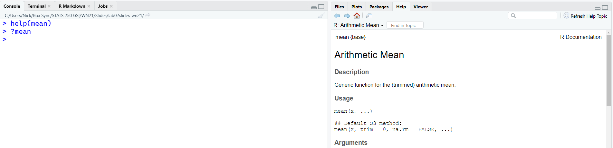

```{r setup, include=FALSE}
options(htmltools.dir.version = FALSE)
knitr::opts_chunk$set(echo = TRUE, include = TRUE, eval = TRUE, comment = NA,
                      fig.height = 5.5)
iClickerAnswers <- FALSE
```

```{r xaringan-themer, include = FALSE, warning = FALSE}
library(xaringanthemer)
# style_mono_light(base_color = "#00274c",
#                  header_font_google = google_font("DM Serif Display"),
#                  text_font_google = google_font("PT Sans", "400", "400i")
# )
style_duo(primary_color = "#00274c",
          secondary_color = "#ffcb05",
          header_font_google = google_font("DM Serif Display"),
          text_font_google = google_font("Source Sans Pro", "400", "400i", "600"),
          code_font_google = google_font("Source Code", "400"),
          text_font_size = "22pt",
          code_font_size = "18pt"
)
xaringanExtra::use_tachyons()
```

```{r xaringanExtra, echo=FALSE}
xaringanExtra::use_webcam()
xaringanExtra::use_fit_screen()
xaringanExtra::use_tachyons()
```

# Announcements and Logistics

- New Piazza setup!
  - Smaller sub-course (~250 students vs. ~900)
  - Please *SEARCH BEFORE POSTING*
- Looking for more R resources?
  - RStudio Primers in the left sidebar of the RStudio Cloud interface
  - [learnr4free.com](https://www.learnr4free.com/en/index.html) - look for "beginner-friendly" in the keywords
- iClicker
  - In the **iClicker REEF app** or on [iclicker.com](https://app.reef-education.com/), complete the assignment for 1 extra credit point on labs.
  - You can earn more than 100% on your lab score.

---
class: center, middle
# Reminders `r emo::ji("bulb")`

Your tasks for the week running Friday 1/29 - Friday 2/5:

| Task | Due Date | Submission |
|:-----|:---------|:-----------|
| Lab 2 | Friday 2/5 12:00PM ET | Canvas |
| Homework 2 | Friday 2/6 12:00PM ET | course.work |

---

# Learning Goals

- Learn how to make a bar chart in R
- Learn how to make frequency tables (one-way and two-way)
- Learn how to make a boxplot in R
- Learn how to find the five-number summary of a variable and find specific numerical summaries
- Learn how to make a histogram in R

---

class: inverse, center, middle

# Let's get started!

---
class: inverse

# RStudio Cloud

## https://rstudio.cloud

*Log in with Google using your U-M Account* (non-umich accounts will be deleted without warning)

# RStudio Desktop

Follow instructions to get lab materials in the assignment on Canvas

---
class: inverse

# Palmer Penguins Data `r emo::ji("penguin")`
We're going to learn about some basic R functions using a data set on 333 penguins living on 3 islands in the Palmer Archipelago in Antarctica. 

.pull-left[
Data were made available by [Dr. Kristen Gorman](www.uaf.edu/cfos/people/faculty/detail/kristen-gorman.php)
and the [Palmer Station, Antarctica Long Term Ecological Research area](pal.lternet.edu), a member of the Long Term Ecological Research Network. The data were prepared by [Dr. Allison Horst](github.com/allisonhorst/palmerpenguins)
]

.pull-right[
]

---
# "Read in" data

```{r readData}
penguins <- read.csv("penguins.csv", stringsAsFactors = TRUE)
```

- The `read.csv` function takes a CSV file and imports it into R.
- What name did we give the data in R?
- Don't worry about `stringsAsFactors = FALSE` right now.

---
# View the `str`ucture of the data

```{r strPenguins}
str(penguins)
```

**IN THE CHAT:** Is `species` categorical or quantitative?

--

**IN THE CHAT:** How do you know?

---
# Frequency Tables

Use the `table()` function on a categorical variable:

```{r table}
table(penguins$species)
```

--
## What's that dollar sign (`$`)?
- You need to tell R what `data.frame` the variable is from.
- The `species` variable is *inside* the `penguins` data.

---
# Frequency Tables

You can make a two-way table by giving `table()` two arguments:

```{r twoWayTable}
table(penguins$species, penguins$island)
```

## Data is *R*eally *C*ool

Data is **R**eally **C**ool, so the first variable you give to `table()` is in the **r**ows of the table, and the second is in the **c**olumns. **ROWS, COLUMNS**
---
# Bar Charts (graphs, plots, you get it)

Let's visualize the categorical `species` variable in the `penguins` data. 

.pull-left[
```{r speciesPlot, fig.show='hide'}
barplot(table(penguins$species),
     xlab = "Species",
     ylab = "Frequency",
     main = "Bar Chart of Number of Penguins of Each Species Observed",
     col = c("darkorange1", "mediumorchid2", "darkcyan"))
```

- `xlab`: x-axis label
- `ylab`: y-axis label
- `main`: plot title
- `col`: colors
]
.pull-right[
`)
]

---
# Penguins Data

```{r strPenguins}
```

**IN THE CHAT:** Is `flipper_length_mm`categorical or quantitative?

--

**IN THE CHAT:** How do you know?

---
# Numerical Summaries

```{r flipperSummaries}
summary(penguins$flipper_length_mm)
```

- `Min.`: minimum (shortest) flipper length
- `1st Qu.`: first quartile flipper length
- `Median`: median flipper length
- `Mean`: mean flipper length
- `3rd Qu.`: third quartile flipper length
- `Max.`: maximum (longest) flipper length

---
# Numerical Summaries

You can always get just the one summary you're looking for by using the specific function:

.pull-left[
```{r summaryFunctions1, error = T}
min(penguins$flipper_length_mm)
mean(penguins$flipper_length_mm)
median(penguins$flipper_length_mm)
```
]
.pull-right[
```{r summaryFunctions2, error = T}
max(penguins$flipper_length_mm)
sd(penguins$flipper_length_mm)
IQR(penguins$flipper_length_mm)
```
]

---
# Boxplots

.pull-left[
```{r boxplot, fig.show='hide'}
boxplot(penguins$flipper_length_mm,
        main = "Boxplot of Penguin Flipper Length",
        ylab = "Flipper Length (mm)")
```
]
.pull-right[
`)
]

---
# Histograms

.pull-left[
```{r hist, fig.show = 'hide'}
hist(penguins$flipper_length_mm)
```

{{content}}
]

.pull-right[
`)
]

--
Those are some terrible axis labels, huh?

Fix them with `main` and `xlab`!

---
# Histograms

.pull-left[
```{r histLabels, fig.show='hide'}
hist(penguins$flipper_length_mm,
     main = "Histogram of Penguin Flipper Length", #<<
     xlab = "Flipper Length (mm)") #<<
```

]

.pull-right[
`)
]

---
# Ask R for help!




---
class: center, inverse, middle

# Now it's your turn!


---

# Lab Project `r emo::ji("keyboard")`

.pull-left[
### Your tasks
- Open "lab02-report.Rmd" from the Files pane
- Answer each question in the provided answer blocks:
```md
:::{.answer}
# Your answer goes here
:::
```
]

.pull-right[
### How to get help
- Use the "labs" section of Piazza to ask questions and work with your peers.
- If you use Piazza, please note that in the "Collaborators" list at the top of the discussion section.
- If you're really stuck, email me! [nseewald+250@umich.edu](mailto:nseewald+250@umich.edu)
]

---

# `r emo::ji("inbox_tray")` Lab Submission: Finding Your Report
Hit the Knit button one last time, then:
.pull-left[
## RStudio Cloud
1. In the Files pane, check the box next to `lab02-report.html`
2. Click More > Export...
3. Click Download and save the file on your computer in a folder you'll remember and be able to find later.
]
.pull-right[
## RStudio Desktop (local)
1. Locate the `lab02-report.html` file on your computer. The file will be saved in the location indicated at the top of the files pane. 
]

---

# `r emo::ji("inbox_tray")` Lab Submission: Canvas (Due 2/5 12p noon ET)
1. Click the "Assignments" panel on the left side of the page. Scroll to find "Lab 1", and open the assignment. Click "Submit Assignment".

2. Towards the bottom of the page, you'll be able to choose `lab02-report.html` from the folder you saved it in from RStudio Cloud or noted if you're using RStudio Desktop. **You will only be able to upload a .html file -- do not upload any other file type.**
3. Click "Submit Assignment". You're done! 
